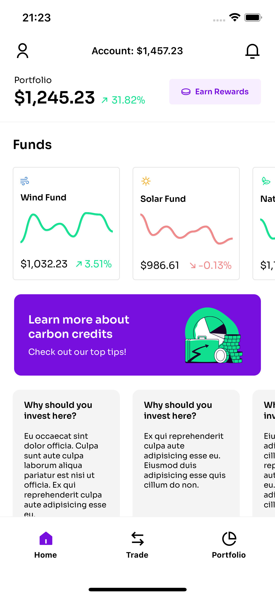

# Crowdfrom: Technical Challenge

This project is a technical challenge for a Senior React Native Developer position at [Crowdfrom](https://crowdform.studio/). 🫶🏻

The application itself consists in an mobile application that helps users to discover and manage funds. The main part of this tool is a dashboard containing charts and statistics related to the funds, that allow users to keep on the evolution of the financial asset.

Sounds awesome, right? (Yep, I know it does!) 🚀

Take a look at the screenshot below or open the design file [here](<https://www.figma.com/file/2bM4PxB3F33biwjvIbcncd/React-Native-Challenge-(Copy)?node-id=0%3A1&t=7bfklx4AYc4R7shG-1>).



Next, we'll check how to run the project and see the magic happens! 🤩

## Dependencies

This project was built in **React Native** and a few more loving technologies.

So, as you already know, we'll need the **Node.js** platform and for this specific case **yarn** package manager as well.

First of all, check if you have those two requirements and pay attention to the version. I'm using Node.js v14.20.1 and yarn v1.22.19. That's it!

If you need more help on that, please take a look at the official React Native documentation [here](https://reactnative.dev/docs/environment-setup).

## How to run the project

Okay, guys, this is the fun part. 😌

Open your terminal, go to the folder you're used to storing your projects. Then, run the following:

```bash
> git clone https://github.com/luiz-from-delta/crowdform-project-app.git
> cd crowdform-project-app
```

Finally, install the dependencies and run the project:

```bash
> yarn
> yarn run ios
> yarn start
```

Simple as that!

Now, if everything is okay, you'll see a simulator showing the app.

Have fun! 🎉

## Next Steps

- I have written down some points to improve and I'd love sharing them in the future.
- That's all for now! :)
